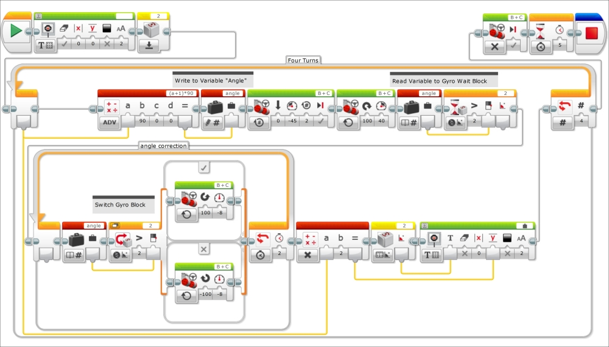

# Equipos

## [BeeBot](https://ro-botica.com/es/tienda/Bee-Bot/)

Alternativa open: [Escornabot](./escornabot.md)

## [Makey-Makey](./MakeyMakey.md)

## Lego

### Lego WeDo (150)

### Lego NXT

[Lego EV3](https://www.amazon.es/LEGO-Mindstorms-juguete-electr%C3%B3nico-31313/dp/B00BMKLVJ6/ref=sr_1_1?ie=UTF8&qid=1495724987&sr=8-1&keywords=lego+ev3) (320€)

## MakeBlock

Es un mecano con corazón de Arduino.

Programable con bloques

[Recursos](https://www.makeblock.es/soporte/robot-mbot/)

[Empezando con MakeBlock](https://programamos.es/conoce-la-interfaz-de-mblock-y-programa-los-primeros-pasos-de-tu-mbot/)

## [Bq robot](https://www.bq.com/es/printbot-evolution) [100€]

## [Raspberry](./Raspberry.md)

## [micro:bit](./Microbit.md)

# Problemas y sus soluciones

## El coste

Uno de los problemas que se plantea cuando se quiere hacer robótica en el aula es que tiene el coste y que normalmente los centros no disponen de presupuesto para ello.
En ese punto siempre aparece la disyuntiva de si usar un kit o los componentes

Por un lado un kit es sencillo de usar pero costoso

Por otro lado los componentes son baratos pero difíciles de usar

Una posible solución consiste en  involucrar a distintos niveles con distintas capacidades y dándoles tareas con distinto nivel de dificultad

Al construir el kit estamos aprendiendo electrónica, soldadura, impresión 3D, a leer esquemas,.... y estamos fabricando los componentes que pueden usar los más pequeños

## Posibilidad de personalización

## Externalizar servicios

* Alquiler de equipos
* Servicios externos de impresión
## Otros proyectos

### [mClon](./mClon.md)

### [Otto](http://www.ottodiy.com/)

### [miniKame](https://github.com/JavierIH/miniKame)

# Robot [edison](https://meetedison.com/)

Hay 2 versiones: v1.0 y v2.0, mucho mejor comprar la 2.0

* Precio: uno 50€
* Es compatible con piezas lego para hacer montajes más complejos
* Incluye en la documentación muchos ejemplos y montajes

### Sensores

* Deteccion de obstáculos derecho e izquierdo
* 1 Seguilínecesitamos
* Receptor de IR (38Khz)
* Siguelíneas (1 solo sensor)
* 2 fototransistores
* Sensor de sonido (piezoeléctrico)

Procesador de 8bits Freescale  8kb

### Programación:

Se programa con un cable específico (EdComm) que se conecta a la salida de audio (del tablet, móvil Android, Raspberry, PC, ...) y que se coloca encima del sensor siguelíneas

#### Programación con código de barras

Podemos grabar un programa sencillo sin más que leer un código, lo que activa un programa:

* Esquivaobstáculos
* Siguelíneas
* Sigueluz
* control por sonido
* Rebota en los bordes
* Sumo wrestle

Podemos usar código de barras para  hacer que responda con ciertos movimiento a ciertas teclas del mando a distancia
(programamos un movimiento para un botón (código) del mando)

Para leer un código, lo colocamos a la derecha (suele haber una flecha) y pulsamos 3 veces el botón de grabación. El robot se mueve sobre el código y lo lee

#### Manejo con mandos a distancia

Se pueden usar diversos modelos de mandos a distancia. Los Sony y los Sansung funcionan perfectamente. Algunos otros como Philips no son compatibles

## Precauciones

Cómo es necesario con todos los robots móviles, conviene disponer de bastante espacio libre sobre la mesa (50cm).

Se mueve bastante rápido, con lo que hay que estár atento!!

## [Descargas](https://meetedison.com/download/)

[Descargas de software](https://meetedison.com/robot-programming-software/)

Hay aplicaciones (open https://github.com/Bdanilko/Edware) para Windows, Linux, MacOS, Android, iOS, web ([web bloques](http://edwareapp.com/?_ga=1.150026806.1695549331.1454041273#) [Web python](http://www.edpyapp.com/))

Se puede programar con bloques, python y código de bárras

[Edware online (bloques)](http://edwareapp.com/?_ga=1.150026806.1695549331.1454041273#)

[Edpy online](http://www.edpyapp.com/#checkcode)

## Libros

[10 Robotics lesson  plans](https://meetedison.com/wp-content/uploads/2015/04/Your-EdVenture-into-Robotics-10-Lesson-Plans.pdf?x20535)

[Libro de actividades](https://meetedison.com/robot-activities/)

[Edison robot activities: controller](https://meetedison.com/wp-content/uploads/2015/04/EdBook1-Your-EdVenture-into-Robotics-You-re-a-Controller.pdf?x20535)

[Edison robot activities: programmer](https://meetedison.com/wp-content/uploads/2015/04/EdBook2-Your-EdVenture-into-Robotics-You-re-a-Programmer.pdf?x20535)

[Edison FAQ](https://meetedison.com/edison-robot-support/edison-robot-faq/)

[Documentación en micro-log](https://edison.micro-log.com/)

### Montaje de varios

Podemos colocar varios conectados (físicamente con los pines de lego) consiguiendo más motores (se comunican entre ellos)

Ejemplo [Impresora/plotter](https://meetedison.com/robot-activities/robot-builder/printer/)

<iframe width="560" height="315" src="https://www.youtube.com/embed/yZILrtHUCxQ" frameborder="0" allowfullscreen></iframe>

## Instalación en Linux

Para ejecutar el software EdWare necesitamos instalar algunas dependencias. Para facilitar la instalación usaremos pyp. Lo instalamos con:

    sudo apt install pyp

Ahora instalamos los paquetes necesarios con:

    sudo pip install jsonpickle
    sudo pip install pygame

Ya podemos ejecutarlo con

  python edware.py
