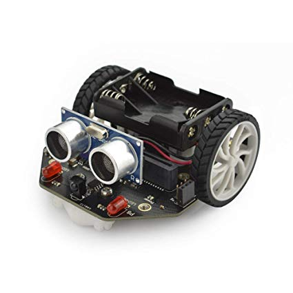

# ROBÓTICA EN EL AULA CON MICRO:BIT

Este curso ofrece al profesorado conocer y utilizar nuevas herramientas para incorporarlas al aula: la programación y la robótica. Podrá conocer diferentes tipos de robot y trabajar con la placa micro:bit dentro del aula, además de familiarizarse con un primer lenguaje de programación de fácil uso a través de bloques gráficos.

## Objetivos

- Conocer las posibilidades de la programación y la robótica en la práctica docente.
- Mostrar al profesorado las ventajas del uso herramientas tales como la programación y la robótica.
- Dar a conocer diferentes tipos de robot y familiarizarse con la placa micro:bit y algunos complementos como la plataforma Maqueen micro:bit.

## Contenidos

1. [Índice](./Indice.md)
1. [Introducción a la robótica](./IniciacionRobotica.md). 
1. La placa [micro:bit](./microbit.md).
    * [Tutorial de uso](./tutorial.md) 
    Haciendo 
    * [Steam con micro:bit](./STEM.md)
1. Robótica sencilla con la plataforma micro:bit:
    * [Robotic car](./car.md)
    * [Maqueen](./MaQueen.md)
1. [Ejemplos hechos](./ejemplosCursoBaza.md)
1. [Ejemplos](./ejemplos.md) de algunos proyectos sencillos
1. Exposición de proyectos realizados

# BBC [Micro:bit](./microbit.md)

# [Robotic car](./car.md)

# [Robot maqueen](./MaQueen.md)

# [Complementos](./Complementos.md)

# [Recursos](./Recursos.md)

